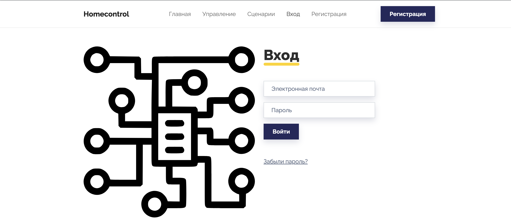
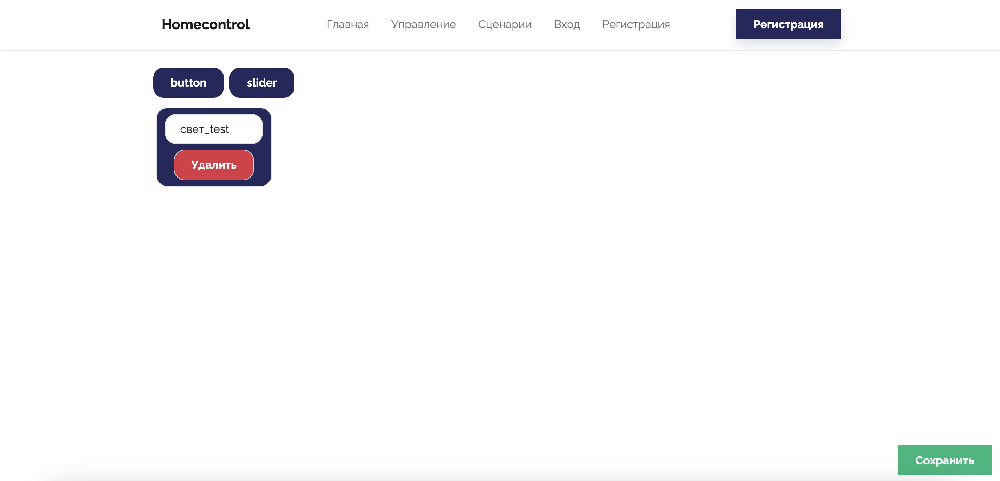

# homecontrol_front

Client for IOT server [Homecontrol_fastapi](https://github.com/Bialri/homecontrol_fastapi)

## Setup for develop
<p>In the root directory create .env file with following settings</p>

```dotenv
VITE_HOST=http(s)://your_host.com/
```
<p>Then you can run local server</p>

```sh
npm install
npm run dev
```

## Setup for deploy

<p>Configure the port of the host machine that you want to use</p>

```yaml
    ports:
      - 'your_port:8080'
```

# Avaliable features

## Registration and login


## Switch control

<b>changing switch names</b>


## Scripts

### Creating and editing scripts


### Managing script actions


### Non-scheduled script execution is also available